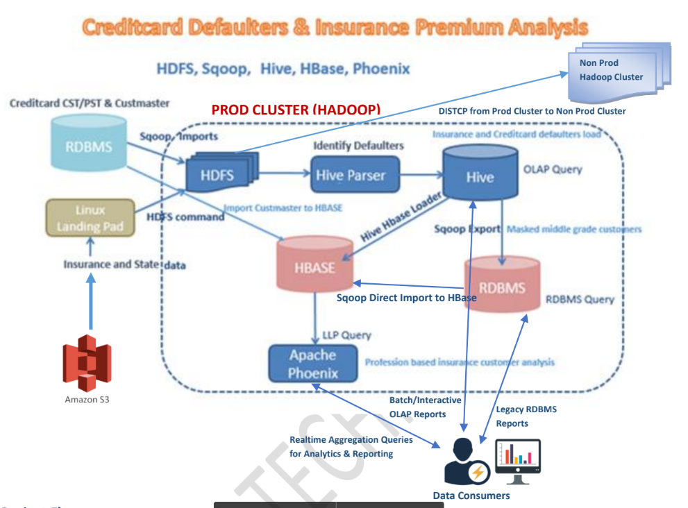

# Project 1 - Calculate Insurance Premium based on Credit History

**Linux shell, script, python, Sqoop, HDFS, Hive, Hbase and Phoenix.**

## Project Synopsis:

This project helps the Financial institutions such and Insurance and Banking systems understands the
Creditcard defaulters to define the Insurance premium accordingly, it analyze a wide variety of online
and offline customer data including the customer transactions, customer master data, insurance data
etc. Bank can analyze this data to generate insights about individual consumer behaviors and
preferences. This tool builds the strategies, Key Performance Indicators (KPI) definitions and
implementation roadmaps that assists our esteemed clients in their Analytics & Information ecosystem
journey right from Strategy definition to large scale Global Implementations & Support using the bigdata
ecosystems.

As a part of Enterprise Data lake build, the data will be persisted into Hadoop file system, HBASE and
Hive are injected using Sqoop for data exchange from DB sources, SFTP/SCP for file transfer from Cloud
platform. Data transformation and processing such as aggregation, filtering, grouping using Hive for
Batch data and Phoenix for online data access on Hbase for realtime data aggregation and reporting as
per the reporting needs.

## Architecture

