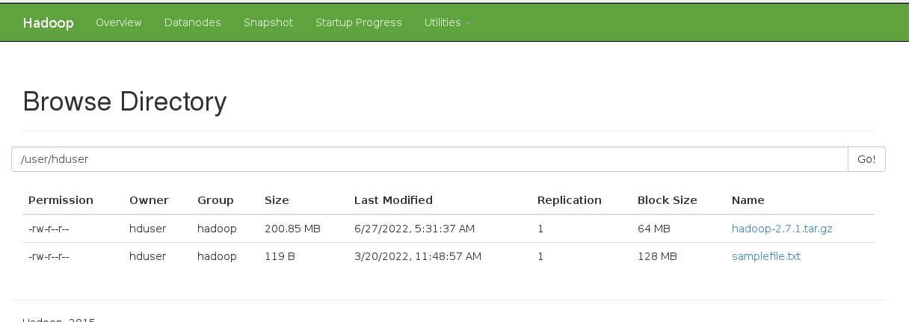
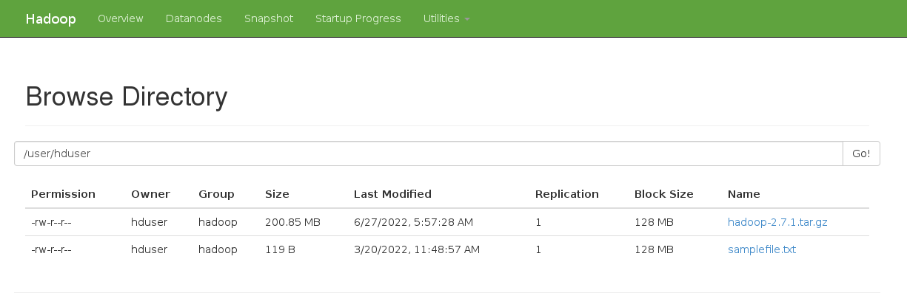
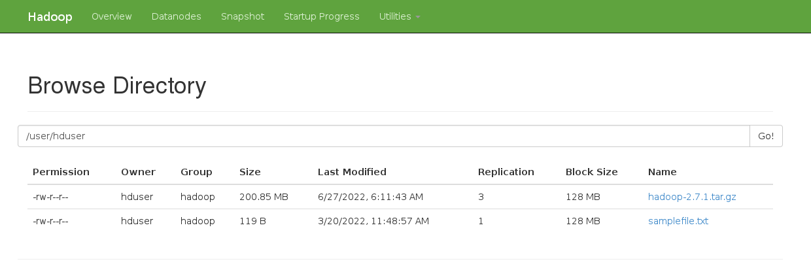

# HDFS Sample Usecases

___
1. Create a new directory in linux namely ~/install/hdfsusecases and create a new file inside the above directory
namely ~/install/hdfsusecases/NYSE_2020_06_20.txt copying the first 1000 lines from an existing file
~/pigdata/NYSE_daily

```
-- check the present working directory
[hduser@localhost ~]$ pwd
/home/hduser

-- Create a new directory
[hduser@localhost ~]$ mkdir ~/install/hdfsusecases

-- check if directory is created
[hduser@localhost ~]$ ls -l ~/install/hdfsusecases
total 0

-- check if the source file exists
[hduser@localhost ~]$ ls -l ~/pigdata/NYSE_daily
-rw-------. 1 hduser hduser 3194099 Jun 16  2015 /home/hduser/pigdata/NYSE_daily

-- copy first 1000 lines from ~/pigdata/NYSE_daily to ~/install/hdfsusecases/NYSE_2020_06_20.txt
[hduser@localhost ~]$ head -1000 ~/pigdata/NYSE_daily > ~/install/hdfsusecases/NYSE_2020_06_20.txt

-- verify if the new file is created
[hduser@localhost ~]$ ls -l ~/install/hdfsusecases/NYSE_2020_06_20.txt
-rw-rw-r--. 1 hduser hduser 57446 Jun 26 10:08 /home/hduser/install/hdfsusecases/NYSE_2020_06_20.txt

-- verify if the lines count is 1000
[hduser@localhost ~]$ wc -l ~/install/hdfsusecases/NYSE_2020_06_20.txt
1000 /home/hduser/install/hdfsusecases/NYSE_2020_06_20.txt

-- compare 1st line from both files 
[hduser@localhost ~]$ sed -n 1p ~/pigdata/NYSE_daily
NYSE|CLI|2009-12-31|35.39|35.70|34.50|34.57|890100|34.12

[hduser@localhost ~]$ sed -n 1p /home/hduser/install/hdfsusecases/NYSE_2020_06_20.txt
NYSE|CLI|2009-12-31|35.39|35.70|34.50|34.57|890100|34.12

-- compare 1000th line from both files 
[hduser@localhost ~]$ sed -n 1000p ~/pigdata/NYSE_daily
NYSE|CVH|2009-01-21|12.16|12.48|11.92|12.41|3220600|12.41

[hduser@localhost ~]$ sed -n 1000p /home/hduser/install/hdfsusecases/NYSE_2020_06_20.txt
NYSE|CVH|2009-01-21|12.16|12.48|11.92|12.41|3220600|12.41

```
___
2. Create another new file inside the above directory namely ~/install/hdfsusecases/NYSE_2020_06_21.txt copying
the line from 1001 to 2000 from an existing file ~/pigdata/NYSE_daily

``` 

-- copy first 1001 to 2000 lines from ~/pigdata/NYSE_daily to ~/install/hdfsusecases/NYSE_2020_06_21.txt
head -n 2000 ~/pigdata/NYSE_daily | tail -n 1000 > ~/install/hdfsusecases/NYSE_2020_06_21.txt

-- verify if the new file is created
[hduser@localhost ~]$ ls -l ~/install/hdfsusecases/NYSE_2020_06_21.txt
-rw-rw-r--. 1 hduser hduser 55610 Jun 26 10:22 /home/hduser/install/hdfsusecases/NYSE_2020_06_21.txt

-- verify if the lines count is 1000
[hduser@localhost ~]$ wc -l /home/hduser/install/hdfsusecases/NYSE_2020_06_21.txt
1000 /home/hduser/install/hdfsusecases/NYSE_2020_06_21.txt

-- compare 1001 line from source and 1st line from new file 
[hduser@localhost ~]$ sed -n 1001p ~/pigdata/NYSE_daily
NYSE|CVH|2009-01-20|12.62|12.79|11.77|11.92|3424400|11.92

[hduser@localhost ~]$ sed -n 1p /home/hduser/install/hdfsusecases/NYSE_2020_06_21.txt
NYSE|CVH|2009-01-20|12.62|12.79|11.77|11.92|3424400|11.92

-- compare 2000 line from source and 1000th line from new file 
[hduser@localhost ~]$ sed -n 2000p ~/pigdata/NYSE_daily
NYSE|CQB|2009-02-10|14.85|14.99|13.65|13.78|660900|13.78

[hduser@localhost ~]$ sed -n 1000p /home/hduser/install/hdfsusecases/NYSE_2020_06_21.txt
NYSE|CQB|2009-02-10|14.85|14.99|13.65|13.78|660900|13.78

```

___
3. Create a directory in Hadoop namely /tmp/hdfsusecases

```
-- check if the directory already exists
[hduser@localhost ~]$ hadoop fs -ls /tmp/hdfsusecases
ls: `/tmp/hdfsusecases': No such file or directory

-- create directory
[hduser@localhost ~]$ hadoop fs -mkdir -p /tmp/hdfsusecases

-- verify if the directory is created
[hduser@localhost ~]$ hadoop fs -ls -d -h /tmp/hdfsusecases
drwxr-xr-x   - hduser supergroup          0 2022-06-26 11:01 /tmp/hdfsusecases


```


___
4. Check whether the above directory is created in HDFS or not using the below command (Note: We use –test –d
option to check whether the given path is a directory or not)
hadoop fs -test -d /tmp/hdfsusecases

``` 

-- check if the path exists
[hduser@localhost ~]$ hadoop fs -test -e /tmp/hdfsusecases

-- check the exit code
[hduser@localhost ~]$ echo $?
0

-- check if the path is a directory
[hduser@localhost ~]$ hadoop fs -test -d /tmp/hdfsusecases

-- check the exit code
[hduser@localhost ~]$ echo $?
0

```

___
5. Check what is the status code of the above command using, if it shows 0 then directory is created, if shows non
zero then the directory is not created then check the step 3 again.
echo $?

``` 

-- check if the path exists
[hduser@localhost ~]$ hadoop fs -test -e /tmp/hdfsusecases

-- check the exit code
[hduser@localhost ~]$ echo $?
0

-- check if the path is a directory
[hduser@localhost ~]$ hadoop fs -test -d /tmp/hdfsusecases

-- check the exit code
[hduser@localhost ~]$ echo $?
0

```

___
6. Copy file generated only in step 1 (~/install/hdfsusecases/NYSE_2020_06_20.txt) from linux to hdfs directory
/tmp/hdfsusecases in the name of NYSE_2020_06.txt

```

-- check if the file exists locally
[hduser@localhost ~]$ ls -l ~/install/hdfsusecases/NYSE_2020_06_20.txt
-rw-rw-r--. 1 hduser hduser 57446 Jun 26 10:08 /home/hduser/install/hdfsusecases/NYSE_2020_06_20.txt

-- copy the file from local to hdfs
[hduser@localhost ~]$ hadoop fs -copyFromLocal /home/hduser/install/hdfsusecases/NYSE_2020_06_20.txt /tmp/hdfsusecases/NYSE_2020_06.txt

-- list the files in the hdfs directory
[hduser@localhost ~]$ hadoop fs -ls /tmp/hdfsusecases/
Found 1 items
-rw-r--r--   1 hduser supergroup      57446 2022-06-27 00:43 /tmp/hdfsusecases/NYSE_2020_06.txt

```

___
7. Like step 4 and 5, check whether the above file (/tmp/hdfsusecases/NYSE_2020_06.txt) is created or not in HDFS,
using -f option and check for the status code using $? and create a zero byte file in HDFS directory
/tmp/hdfsusecases in the name of _SUCCESS

``` 

-- check if the path exists
[hduser@localhost ~]$ hadoop fs -test -e /tmp/hdfsusecases/NYSE_2020_06.txt

-- check the exit code
[hduser@localhost ~]$ echo $?
0

-- check if the path is a file
[hduser@localhost ~]$ hadoop fs -test -f /tmp/hdfsusecases/NYSE_2020_06.txt

-- check the exit code
[hduser@localhost ~]$ echo $?
0

-- create zero byte file
[hduser@localhost ~]$ hadoop fs -touchz /tmp/hdfsusecases/_SUCCESS

-- list the files in the hdfs directory
[hduser@localhost ~]$ hadoop fs -ls /tmp/hdfsusecases/
Found 2 items
-rw-r--r--   1 hduser supergroup      57446 2022-06-27 00:43 /tmp/hdfsusecases/NYSE_2020_06.txt
-rw-r--r--   1 hduser supergroup          0 2022-06-27 01:00 /tmp/hdfsusecases/_SUCCESS

```

___
8. Append the file generated in step 2 in linux (~/install/hdfsusecases/NYSE_2020_06_21.txt) with the file generated
in step 6 in the hdfs directory /tmp/hdfsusecases/NYSE_2020_06.txt

``` 
-- check if the file exists locally
[hduser@localhost ~]$ ls -l ~/install/hdfsusecases/NYSE_2020_06_21.txt
-rw-rw-r--. 1 hduser hduser 55552 Jun 26 10:32 /home/hduser/install/hdfsusecases/NYSE_2020_06_21.txt

-- list the files in the hdfs directory before appending
[hduser@localhost ~]$ hadoop fs -ls /tmp/hdfsusecases/
Found 2 items
-rw-r--r--   1 hduser supergroup      57446 2022-06-27 00:43 /tmp/hdfsusecases/NYSE_2020_06.txt
-rw-r--r--   1 hduser supergroup          0 2022-06-27 01:00 /tmp/hdfsusecases/_SUCCESS

-- append the file from local to hdfs
[hduser@localhost ~]$ hadoop fs -appendToFile ~/install/hdfsusecases/NYSE_2020_06_21.txt /tmp/hdfsusecases/NYSE_2020_06.txt

-- list the files in the hdfs directory after appending
[hduser@localhost ~]$ hadoop fs -ls /tmp/hdfsusecases/
Found 2 items
-rw-r--r--   1 hduser supergroup     112998 2022-06-27 01:09 /tmp/hdfsusecases/NYSE_2020_06.txt
-rw-r--r--   1 hduser supergroup          0 2022-06-27 01:00 /tmp/hdfsusecases/_SUCCESS

```

___
9. Count the size of the file in HDFS /tmp/hdfsusecases/NYSE_2020_06.txt

```
-- find the size of hdfs file 
[hduser@localhost ~]$ hadoop fs -count /tmp/hdfsusecases/NYSE_2020_06.txt
           0            1             112998 /tmp/hdfsusecases/NYSE_2020_06.txt

```
___
10. Count the number of rows are there in the /tmp/hdfsusecases/NYSE_2020_06.txt (Which should show the total
count of the files created in step1 and 2)

``` 
-- count the no of lines in hdfs file
[hduser@localhost ~]$ hadoop fs -cat /tmp/hdfsusecases/NYSE_2020_06.txt | wc -l
2000

```

___
11. Display only line 11 to 20 from the file in HDFS /tmp/hdfsusecases/NYSE_2020_06.txt

``` 

[hduser@localhost ~]$ hadoop fs -cat /tmp/hdfsusecases/NYSE_2020_06.txt | head -20 | tail -10
NYSE|CLI|2009-12-16|34.79|35.10|34.48|34.66|1007900|34.21
NYSE|CLI|2009-12-15|34.60|34.91|34.39|34.84|813200|34.39
NYSE|CLI|2009-12-14|34.21|34.90|33.86|34.82|987700|34.37
NYSE|CLI|2009-12-11|33.55|34.08|33.40|34.00|836500|33.56
NYSE|CLI|2009-12-10|33.61|33.80|33.09|33.26|1296300|32.83
NYSE|CLI|2009-12-09|33.25|33.71|33.01|33.25|863900|32.82
NYSE|CLI|2009-12-08|32.57|33.80|32.52|33.18|890000|32.75
NYSE|CLI|2009-12-07|33.63|33.77|32.78|33.00|961800|32.57
NYSE|CLI|2009-12-04|33.46|34.12|33.16|33.69|1412400|33.25
NYSE|CLI|2009-12-03|32.55|33.43|32.48|32.65|1170600|32.22
cat: Unable to write to output stream.

```

___
12. Store line 11 to 20 from the file in HDFS /tmp/hdfsusecases/NYSE_2020_06.txt into linux file namely
~/install/hdfsusecases/NYSE_sampledata1.txt

``` 

-- redirect the lines 11-20 to a file
[hduser@localhost ~]$ hadoop fs -cat /tmp/hdfsusecases/NYSE_2020_06.txt | head -20 | tail -10 > ~/install/hdfsusecases/NYSE_sampledata1.txt
cat: Unable to write to output stream.

-- display the newly created file
[hduser@localhost ~]$ cat ~/install/hdfsusecases/NYSE_sampledata1.txt
NYSE|CLI|2009-12-16|34.79|35.10|34.48|34.66|1007900|34.21
NYSE|CLI|2009-12-15|34.60|34.91|34.39|34.84|813200|34.39
NYSE|CLI|2009-12-14|34.21|34.90|33.86|34.82|987700|34.37
NYSE|CLI|2009-12-11|33.55|34.08|33.40|34.00|836500|33.56
NYSE|CLI|2009-12-10|33.61|33.80|33.09|33.26|1296300|32.83
NYSE|CLI|2009-12-09|33.25|33.71|33.01|33.25|863900|32.82
NYSE|CLI|2009-12-08|32.57|33.80|32.52|33.18|890000|32.75
NYSE|CLI|2009-12-07|33.63|33.77|32.78|33.00|961800|32.57
NYSE|CLI|2009-12-04|33.46|34.12|33.16|33.69|1412400|33.25
NYSE|CLI|2009-12-03|32.55|33.43|32.48|32.65|1170600|32.22

```

___
13. Delete the line number 1 from the HDFS file /tmp/hdfsusecases/NYSE_2020_06.txt , for example if the above file
contains 100 rows, after deletion it should have only 99 rows in HDFS
Note: we can’t do this directly because of the WORM property of HDFS data, think about the possible work
around and try to achive the result

``` 

-- check the lines count in hdfs file
[hduser@localhost ~]$ hadoop fs -cat /tmp/hdfsusecases/NYSE_2020_06.txt | wc -l
2000

-- check the present working directory in local
[hduser@localhost ~]$ pwd
/home/hduser

-- create a temporary working directory in local
[hduser@localhost ~]$ mkdir tmp

-- change to temporary working directory in local
[hduser@localhost ~]$ cd tmp

-- check the present working directory in local
[hduser@localhost tmp]$ pwd
/home/hduser/tmp

-- copy the file from hdfs to temporary working directory in local
[hduser@localhost tmp]$ hadoop fs -copyToLocal /tmp/hdfsusecases/NYSE_2020_06.txt ~/tmp

-- check if the file is copied to local
[hduser@localhost tmp]$ ls -l ~/tmp/
total 112
-rw-r--r--. 1 hduser hduser 112998 Jun 27 03:33 NYSE_2020_06.txt

-- check the lines count in local
[hduser@localhost tmp]$ cat NYSE_2020_06.txt | wc -l
2000

-- delete the file from hdfs
[hduser@localhost tmp]$ hadoop fs -rm /tmp/hdfsusecases/NYSE_2020_06.txt 
Deleted /tmp/hdfsusecases/NYSE_2020_06.txt

-- ensure the file is deleted
[hduser@localhost tmp]$ hadoop fs -ls /tmp/hdfsusecases/
Found 1 items
-rw-r--r--   1 hduser supergroup          0 2022-06-27 01:00 /tmp/hdfsusecases/_SUCCESS

-- now remove the first line while copying from local to hdfs
awk 'NR != 1 {print}' ~/tmp/NYSE_2020_06.txt | hdfs dfs -put - /tmp/hdfsusecases/NYSE_2020_06.txt

-- check if the file is copied from local to hdfs
[hduser@localhost tmp]$ hadoop fs -ls /tmp/hdfsusecases/
Found 2 items
-rw-r--r--   1 hduser supergroup     112941 2022-06-27 03:40 /tmp/hdfsusecases/NYSE_2020_06.txt
-rw-r--r--   1 hduser supergroup          0 2022-06-27 01:00 /tmp/hdfsusecases/_SUCCESS


-- count the no of lines in new hdfs file
[hduser@localhost tmp]$ hadoop fs -cat /tmp/hdfsusecases/NYSE_2020_06.txt | wc -l
1999

-- come out of temprary temporary working directory in local
[hduser@localhost tmp]$ cd ~
[hduser@localhost ~]$ pwd
/home/hduser

```

___
14. Copy the above file /tmp/hdfsusecases/NYSE_2020_06.txt in the name of

/tmp/hdfsusecases/NYSE_2020_06_bkp.txt

``` 

-- list the files in hdfs directory
[hduser@localhost ~]$ hadoop fs -ls /tmp/hdfsusecases/
Found 2 items
-rw-r--r--   1 hduser supergroup     112941 2022-06-27 03:40 /tmp/hdfsusecases/NYSE_2020_06.txt
-rw-r--r--   1 hduser supergroup          0 2022-06-27 01:00 /tmp/hdfsusecases/_SUCCESS

-- take a backup preserving the timestamp and other attributes
[hduser@localhost ~]$ hadoop fs -cp -ptopax /tmp/hdfsusecases/NYSE_2020_06.txt /tmp/hdfsusecases/NYSE_2020_06_bkp.txt

-- list the files in hdfs directory to check if the backup file is created
[hduser@localhost ~]$ hadoop fs -ls /tmp/hdfsusecases/
Found 3 items
-rw-r--r--   1 hduser supergroup     112941 2022-06-27 03:40 /tmp/hdfsusecases/NYSE_2020_06.txt
-rw-r--r--   1 hduser supergroup     112941 2022-06-27 03:40 /tmp/hdfsusecases/NYSE_2020_06_bkp.txt
-rw-r--r--   1 hduser supergroup          0 2022-06-27 01:00 /tmp/hdfsusecases/_SUCCESS


```

___
15. Merge the files in HDFS /tmp/hdfsusecases/NYSE_2020_06.txt and /tmp/hdfsusecases/NYSE_2020_06_bkp.txt
into Linux directory namely ~/install/hdfsusecases/NYSE_2020_06_merged.txt
Note: We have to use the option called -getmerge to achieve this as given below.
hadoop fs -getmerge /tmp/hdfsusecases/NYSE_2020_06_bkp.txt /tmp/hdfsusecases/NYSE_2020_06.txt
~/install/hdfsusecases/NYSE_2020_06_merged.txt

``` 
-- merge the hdfs files and copy it to local
[hduser@localhost ~]$ hadoop fs -getmerge /tmp/hdfsusecases/NYSE_2020_06_bkp.txt /tmp/hdfsusecases/NYSE_2020_06.txt ~/install/hdfsusecases/NYSE_2020_06_merged.txt

-- check the new file
[hduser@localhost ~]$ ls -l ~/install/hdfsusecases/NYSE_2020_06_merged.txt
-rw-r--r--. 1 hduser hduser 225882 Jun 27 05:23 /home/hduser/install/hdfsusecases/NYSE_2020_06_merged.txt

```

___
16. Set the blocksize 64MB while writing the file in HDFS, check in the UI how many blocks are generated
hadoop fs -D dfs.block.size=67108864 -put /home/hduser/install/hadoop-2.7.1.tar.gz /user/hduser/

``` 
[hduser@localhost ~]$ hadoop fs -D dfs.block.size=67108864 -put /home/hduser/install/hadoop-2.7.1.tar.gz /user/hduser/

Refer Image below:

```


___
17. Set the blocksize 128MB (134217728) for the same file generated in step 16 and replace the existing file in HDFS.

``` 
-- delete the previous file from hdfs
[hduser@localhost ~]$ hadoop fs -rm /user/hduser/hadoop-2.7.1.tar.gz
Deleted /user/hduser/hadoop-2.7.1.tar.gz

-- double check
[hduser@localhost ~]$ hadoop fs -ls /user/hduser/hadoop-2.7.1.tar.gz
ls: `/user/hduser/hadoop-2.7.1.tar.gz': No such file or directory

[hduser@localhost ~]$ hadoop fs -D dfs.block.size=134217728 -put /home/hduser/install/hadoop-2.7.1.tar.gz /user/hduser/

Refer Image below:

```


___
18. Set the replication to 3 while writing the file in HDFS
hadoop fs -D dfs.replication=3 -put /home/hduser/install/hadoop-2.7.1.tar.gz /user/hduser/

``` 
-- delete the previous file from hdfs
[hduser@localhost ~]$ hadoop fs -rm /user/hduser/hadoop-2.7.1.tar.gz
Deleted /user/hduser/hadoop-2.7.1.tar.gz

-- double check
[hduser@localhost ~]$ hadoop fs -ls /user/hduser/hadoop-2.7.1.tar.gz
ls: `/user/hduser/hadoop-2.7.1.tar.gz': No such file or directory

[hduser@localhost ~]$ hadoop fs -D dfs.replication=3 -put /home/hduser/install/hadoop-2.7.1.tar.gz /user/hduser/

Refer Image below:

```



___
19. To check the block information (In which datanode block is present,no of blocks,size,replication, etc)
hadoop fsck - -files -locations -blocks /user/hduser/hadoop-2.7.1.tar.gz

``` 

[hduser@localhost ~]$ hadoop fsck - -files -locations -blocks /user/hduser/hadoop-2.7.1.tar.gz
DEPRECATED: Use of this script to execute hdfs command is deprecated.
Instead use the hdfs command for it.

Connecting to namenode via http://localhost:50070/fsck?ugi=hduser&files=1&locations=1&blocks=1&path=%2Fuser%2Fhduser%2Fhadoop-2.7.1.tar.gz
FSCK started by hduser (auth:SIMPLE) from /127.0.0.1 for path /user/hduser/hadoop-2.7.1.tar.gz at Mon Jun 27 06:19:13 EDT 2022
/user/hduser/hadoop-2.7.1.tar.gz 210606807 bytes, 2 block(s):  Under replicated BP-1791687383-127.0.0.1-1647790118119:blk_1073741835_1012. Target Replicas is 3 but found 1 replica(s).
 Under replicated BP-1791687383-127.0.0.1-1647790118119:blk_1073741836_1013. Target Replicas is 3 but found 1 replica(s).
0. BP-1791687383-127.0.0.1-1647790118119:blk_1073741835_1012 len=134217728 repl=1 [DatanodeInfoWithStorage[127.0.0.1:50010,DS-4244cc90-5afc-4474-8dac-033f4bb19e5e,DISK]]
1. BP-1791687383-127.0.0.1-1647790118119:blk_1073741836_1013 len=76389079 repl=1 [DatanodeInfoWithStorage[127.0.0.1:50010,DS-4244cc90-5afc-4474-8dac-033f4bb19e5e,DISK]]

Status: HEALTHY
 Total size:	210606807 B
 Total dirs:	0
 Total files:	1
 Total symlinks:		0
 Total blocks (validated):	2 (avg. block size 105303403 B)
 Minimally replicated blocks:	2 (100.0 %)
 Over-replicated blocks:	0 (0.0 %)
 Under-replicated blocks:	2 (100.0 %)
 Mis-replicated blocks:		0 (0.0 %)
 Default replication factor:	1
 Average block replication:	1.0
 Corrupt blocks:		0
 Missing replicas:		4 (66.666664 %)
 Number of data-nodes:		1
 Number of racks:		1
FSCK ended at Mon Jun 27 06:19:13 EDT 2022 in 37 milliseconds


The filesystem under path '/user/hduser/hadoop-2.7.1.tar.gz' is HEALTHY


```
___
20. Important Command DistCp (distributed copy) is a tool used for copying data between one Hadoop cluster to
another cluster or with in the same cluster using mappers. (Interview Question – how do you copy data from
production Hadoop cluster to Dev Hadoop cluster)
hadoop distcp hdfs://localhost:54310/user/hduser/hadoop-2.7.1.tar.gz
hdfs://localhost:54310/user/hduser/hadoop/


___
21. choose to overwrite the target files unconditionally even if it exists using upto 2 mappers depends
hadoop distcp -overwrite hdfs://localhost:54310/user/hduser/hadoop-2.7.1.tar.gz
hdfs://localhost:54310/user/hduser/hadoop/


___
22. To view the content of editlog file, need to convert into xml file using editlog viewer
hdfs oev -i edits_inprogress_0000000000000009315 -o edittest.xml

___
